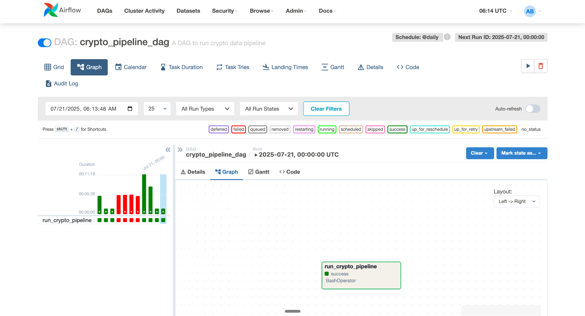

# Crypto Data Pipeline 🚀


---

A production-ready data engineering pipeline that ingests live cryptocurrency data from the [CoinGecko API](https://www.coingecko.com/), validates its schema, saves it as Parquet files, and uploads it to an AWS S3 data lake. The entire workflow is orchestrated using Apache Airflow and modularized for maintainability.

---

## 📌 Key Features

- ⛽ **Ingestion:** Live data from CoinGecko API (top 100 coins by market cap)
- ✅ **Schema Validation:** Ensures consistent, typed data using PyArrow
- 📀 **Storage:** Saves daily snapshots locally as `.parquet` files
- ☁️ **Cloud Upload:** Auto-uploads to AWS S3 as a data lake-ready format
- ⚙️ **Orchestration:** End-to-end flow automated via Apache Airflow
- 🔀 **Modular Design:** Separate modules for extract, load, validate
- 🔐 **Configurable:** Uses `.env` for environment-specific variables

---

## 🛠️ Tech Stack

- **Python 3.10+**
- **Apache Airflow** (Local setup)
- `pandas`, `requests`, `boto3`, `pyarrow`
- `python-dotenv` for config
- **AWS S3** for cloud storage

---

## 🧱 Architecture

This project follows a modular pattern and uses Airflow for daily orchestration:


---

## 📂 Folder Structure

\```bash
crypto-data-pipeline/
├── crypto_data_pipeline/
│   ├── config/               # Configuration (future use)
│   ├── dags/                 # Airflow DAGs
│   ├── data/                 # Local .parquet data files
│   ├── extract/              # Fetching data from API
│   ├── load/                 # Uploading to AWS S3
│   ├── schema/               # Schema validation logic
│   ├── logs/                 # Pipeline logging (optional)
│   ├── notebooks/            # Dev or EDA notebooks
│   ├── __init__.py
│   ├── main.py               # Entry point (optional if DAG handles all)
│   └── ...
├── dags/                    # DAG file if outside package
├── requirements.txt         # Dependencies
├── .env                     # API keys, AWS credentials
├── .gitignore
├── README.md
└── setup_project.py         # Setup utility (optional)
\```

---

## 🚀 Getting Started

1. **Clone the repo:**
   \```bash
   git clone https://github.com/Athirath-1304/crypto-data-pipeline.git
   cd crypto-data-pipeline
   \```

2. **Install dependencies:**
   \```bash
   pip install -r requirements.txt
   \```

3. **Set up environment variables:**
   Create a `.env` file:
   \```dotenv
   AWS_ACCESS_KEY_ID=...
   AWS_SECRET_ACCESS_KEY=...
   S3_BUCKET_NAME=athirath-crypto-data-lake
   \```

4. **Run Airflow:**
   \```bash
   airflow standalone
   \```

5. **Trigger the DAG:**
   - Open `localhost:8080`
   - Start `crypto_pipeline_dag`

---
## 🖥️ Airflow DAG UI

> Example snapshot of the DAG running locally:




## 📌 Status

🟢 **Stable** — currently running locally with full functionality.

Next Steps:
- [ ] Add unit tests
- [ ] Integrate AWS Athena for querying
- [ ] Add CI/CD GitHub Actions

---

## 📜 License

This project is licensed under the [MIT License](LICENSE).

---

## 🙌 Connect

Built by [Athirath Bommerla](https://www.linkedin.com/in/athirathbommerla)

---

> ⭐ Star this repo if you found it helpful!
